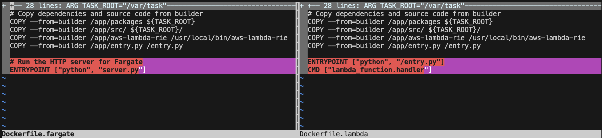

You've bought in to using containers to package AWS Lambda functions but now you're curious...

If you had to, could you migrate that same function to AWS Fargate?
<!--truncate-->

📦 Code Along: This post references a complete working example on [GitHub](https://github.com/curiousdev-io/lambda-to-fargate/tree/main). Clone it to follow along hands-on. There are Go and Python examples.

I had a theory: if I keep my business logic separate from infrastructure code, switching from Lambda to Fargate should be trivial. So I built the same API twice — once for Lambda, once for Fargate — using the same container image.

Spoiler: I was right. Here's what I learned.

## Why is AWS Lambda a Good Place to Start for Serverless Compute?

### No Server Management

AWS Lambda provides operational simplicity for developers. Yes, there are servers in serverless compute, but they're not your worry.

Do you like to patch operating systems or update firmware? 

Didn't think so.

### Simple Scalability

AWS Lambda will scale up as it needs to through a unit called **concurrency**. It can scale up, I promise. I've seen functions hum along at 30,000+ concurrency. Also important to consider - it can scale down to 0 when it's not being used.

### Cost per Value

AWS Lambda functions are triggered by events. Those events should have an association with business value. You're not paying for idle time.

### Built-in Availability Zone Resiliency

AWS Lambda is meant to be highly available with a AWS Region boundary. This means that, by default, you won't have to specify a AZ for your function to be associated with.

What happens if you're running VPC-enbled functions?

No problem - AWS will make sure your functions are highly available when you associate your function with subnets in multiple Availability Zones.

## Why Would You Want to Migrate from AWS Lambda to AWS Fargate?

AWS Lambda and AWS Fargate are both really capable serverless compute options. I'm a **huge** fan of AWS Lambda. I've dedicated a non-trivial amount of my career to helping customers large and small build out Lambda applications. However, it's not the right service to use in all instances. 

Why would you want to migrate from AWS Lambda to AWS Fargate?

### Limits

* **15 minute execution limit**: That's it. Your function gets killed at 15 minutes, no exceptions. Running a long ETL job? Processing a large video file? You'll need to break it up or move elsewhere. Fargate? Tasks can run and run and run.

* **Package size limit**: This in't a big concern for container packaged functions (10 GB limit) but if you're using zip packaging you'll need to contend with two limits - the 50 MB limit for your zipped function code and the 250 MB limit for your unzipped code, including AWS Lambda layers. AWS Fargate doesn't have this limit.

* **Resource limit**: Lambda's resource model is beautifully simple — you set RAM and CPU scales with it. But that simplicity has a ceiling: 10 GB max. Need more? Want to tune CPU independently? No-can-do. Fargate gives you up to 120 GB RAM and 16 vCPUs with fine-grained control.

### Cost

AWS Lambda will bill you for use, down to the millisecond. There really is no idle billing. That's awesome, but cloud costs tend to be more expensive for frequently invoked functions. AWS Fargate charges you a fixed cost per-second for allocated CPU and memory, regardless of idle time.

What's the break-even point? It depends on your utilization patterns, but as a rough guide: if your Lambda runs continuously (high invocation rate, minimal idle time), Fargate often wins. I'll dig into the math in a future post.

### Latency

I'll address this in two steps. The first one I'll consider is initialization (i.e. cold start). The second one I'll consider is warm invocation.

Assuming your function hasn't been invoked in some time (~5min for non-VPC enabled Lambda functions, ~15min for VPC enabled Lambda functions), your invocation will go through a [full initialization](https://docs.aws.amazon.com/lambda/latest/dg/lambda-runtime-environment.html). Depending on the latency requirements of your application, that initialization time may be too long. AWS provides ways to mitigate cold starts (e.g. [provisioned concurrency](https://docs.aws.amazon.com/lambda/latest/dg/provisioned-concurrency.html), [snapstart](https://docs.aws.amazon.com/lambda/latest/dg/snapstart.html)) but you may decide that you can't deal with the hit.

<mini-rant>
Cold starts tend to be a boogieman for AWS Lambda developers. Don't let it be. Consider how often they happen, how long they are, and whether they truly affect your application's SLA.
</mini-rant>

AWS Fargate provides warm, consistent per-request latency.

## How Do We Migrate from AWS Lambda to Fargate?

There are two aspects to consider when moving from AWS Lambda to AWS Fargate. The first is application packaging and the second is application structure.

### Application Packaging

Lambda function packaging plays a really important role in this part of the post. Remember, there are two ways to package up Lambda functions:

* Zip files

* Container images

Zip files offer a really easy way to bundle up your Lambda function. Like - really easy. You can manually zip your code and upload it to the AWS console if you want.

:::tip
Don't just manually upload zip files to the AWS console. Please don't. Use repeatable Infrastructure as Code (IaC) like the [AWS SAM CLI](https://docs.aws.amazon.com/serverless-application-model/latest/developerguide/what-is-sam.html), [AWS CloudFormation](https://aws.amazon.com/cloudformation/), [AWS CDK](https://aws.amazon.com/cdk/), [Terraform](https://developer.hashicorp.com/terraform) / [OpenTofu](https://opentofu.org/), [Pulumi](https://www.pulumi.com/). Literally any one of these is a better option than manually uploading a zip file.
:::

Unfortunately, AWS Fargate tasks can't just take zip files and run them inside a container. If you're packaging your functions via zip files you'll need to switch to container packaging. This isn't terrible - I have a few post outlining how to create containerized Lambda functions [Part 1](https://blog.curiousdev.io/aws-lambda-container-images-part-1-aws-base-image-for-lambda) [Part 2](https://blog.curiousdev.io/aws-lambda-container-images-part-2-aws-os-only-image-for-lambda) [Part 3](https://blog.curiousdev.io/aws-lambda-container-images-part-3-custom-image-for-lambda) - but it is something you'll need to do.

### Application Structure

For better of worse, developers getting started with AWS Lambda tend to combine infrastructure code - _how_ your code runs - with business logic - _what_ your code does.

For example, take a look at this really simple Python Lambda function. It is no doubt a Lambda function. 

```python
def lambda_handler(event, context):
    # Infrastructure concerns mixed with business logic
    body = json.loads(event['body'])  # Lambda event format
    user_id = event['requestContext']['authorizer']['claims']['sub']  # API Gateway structure
    
    # Business logic buried inside
    if not body.get('email'):
        return {  # Lambda response format
            'statusCode': 400,
            'body': json.dumps({'error': 'Email required'})
        }
    
    result = create_user(body['email'], user_id)
    
    # More infrastructure coupling
    return {
        'statusCode': 200,
        'headers': {'Content-Type': 'application/json'},
        'body': json.dumps(result)
    }
```

What are some of the problems that result?

* Can't test business logic without mocking Lambda events  
* Can't run locally without SAM/LocalStack  
* Can't move to Fargate/ECS/K8s without rewriting

It's far better to separate your business logic and infrastructure code.

## The Architecture: One Function, Two Wrappers

The key insight is simple: **Lambda and Fargate can call the same business logic**. You just need a thin adapter layer for each platform.

Here's the core business logic that works identically in both Lambda and Fargate:

```python
# app.py - Pure business logic
import json
from datetime import datetime, UTC


def main(event=None, context=None):
    """
    Main business logic. Can be called from Lambda or Fargate.
    Handles ALB events for /hello and /goodbye routes.
    """
    path = event.get("path") or event.get("rawPath", "")
    query = event.get("queryStringParameters", {}) or {}
    name = query.get("name", "World")
    now = datetime.now(UTC).isoformat()
    status = 200
    
    if path.startswith("/hello"):
        message = f"Hello, {name}"
    elif path.startswith("/goodbye"):
        message = f"Goodbye, {name}"
    else:
        status = 404
        message = "Not found"
    
    body = json.dumps({"timestamp": now, "status": status, "message": message})
    
    return {
        "statusCode": status,
        "body": body,
        "headers": {"Content-Type": "application/json"},
    }
```

Notice what's NOT in this code:
- No `lambda_handler` function name
- No AWS SDK imports
- No Flask/FastAPI decorators
- Just pure business logic that accepts an event dict and returns a response dict

### For Lambda: Direct Invocation

Lambda can call this directly. The Lambda runtime just needs a thin wrapper:

```python
from typing import Dict

from aws_lambda_powertools import Logger
from aws_lambda_powertools.utilities.typing import LambdaContext
from app import main

logger = Logger()


@logger.inject_lambda_context
def handler(event: Dict, context: LambdaContext) -> Dict[str, str]:
    response = main(event, context)
    logger.info(response)
    return response
```

That's it. Lambda's API Gateway or ALB integration sends the event in the right format, and our `main` function handles it.

### For Fargate: HTTP to Lambda Event Adapter

Fargate receives HTTP requests, not Lambda events. So we need an adapter that converts HTTP → Lambda event format → calls `main()`:

```python
# server.py - Simple HTTP server for running the Lambda function in Fargate
import json
from http.server import BaseHTTPRequestHandler, HTTPServer
from urllib.parse import urlparse, parse_qs
from aws_lambda_powertools import Logger
from app import main

logger = Logger()


class LambdaHTTPHandler(BaseHTTPRequestHandler):
    """HTTP handler that converts HTTP requests to Lambda event format"""
    
    def do_GET(self):
        """Handle GET requests"""
        # Parse the URL
        parsed_url = urlparse(self.path)
        
        # Create a Lambda-like event from the HTTP request
        event = {
            "version": "2.0",
            "routeKey": f"GET {parsed_url.path}",
            "rawPath": parsed_url.path,
            "rawQueryString": parsed_url.query,
            "queryStringParameters": {
                k: v[0] for k, v in parse_qs(parsed_url.query).items()
            } if parsed_url.query else {},
            "requestContext": {
                "http": {
                    "method": "GET",
                    "path": parsed_url.path
                }
            }
        }
        
        # Call the main function (same one Lambda uses!)
        response = main(event)
        
        # Log the response using structured logging
        logger.info(response)
        
        # Send the response
        self.send_response(response.get("statusCode", 200))
        
        # Send headers
        headers = response.get("headers", {})
        for key, value in headers.items():
            self.send_header(key, value)
        self.end_headers()
        
        # Send body
        body = response.get("body", "")
        self.wfile.write(body.encode() if isinstance(body, str) else body)
    
    def log_message(self, format, *args):
        """Override to use structured logging"""
        logger.info(format % args)


def run_server(port=8080):
    """Run the HTTP server"""
    server_address = ('', port)
    httpd = HTTPServer(server_address, LambdaHTTPHandler)
    logger.info(f"Starting HTTP server on port {port}")
    httpd.serve_forever()


if __name__ == "__main__":
    import os
    port = int(os.environ.get("PORT", 8080))
    run_server(port)
```

The adapter does three things:
1. Receives HTTP request
2. Converts it to Lambda event format
3. Calls `main()` and returns the response

This means **zero changes to business logic** when moving between Lambda and Fargate.

:::info
I'm going to be showing an easier way to do this in a future post.
:::

## Tying it Together

We know we need to use containers to minimize the packaging switching cost. We also know we need to separate our business logic from our infrastructure logic. Let's review the one place where the two come together - the venerable `Dockerfile`.

This is where we'll need to make some changes when moving from one AWS serverless compute service to another.

### How Does the Dockerfile Change?

Done well, the Dockerfile doesn't have to change too much when changing the deployment target from AWS Lambda to AWS Fargate. I have two sample APIs in the [supporting code repository](https://github.com/curiousdev-io/lambda-to-fargate/tree/main) but the tl;dr the Dockerfile barely changes. We're not rebuilding the application — we're just swapping the entrypoint. The Lambda runtime interface is replaced by a simple HTTP server, but the container image is 95% identical. This proves the portability of containerized Lambda functions.

Need proof? Here is the `diff` between the files.



### What Actually Stays the Same?

✅ Business logic  
✅ Application dependencies  
✅ Environment variables  
✅ IAM permissions  
✅ Logging patterns  
✅ The container image itself

The only difference? How we start the container.

## When Would You Actually Do This?

Look, I'm not saying you should run out and migrate everything to Fargate. Lambda is great for most workloads. But there are real scenarios where this flexibility matters:

* Your Lambda bill crosses $5k/month on continuous workloads  
* You hit the 15-minute execution limit on batch jobs  
* Cold starts are killing your p99 latency  
* You need persistent WebSocket connections

In those cases, having the option to switch without rewriting everything? That's valuable.

## Try It Yourself

Clone the [lambda-to-fargate repo](https://github.com/curiousdev-io/lambda-to-fargate), run both versions locally, then deploy to AWS using the included SAM templates. Invoke both functions with the same Docker container.

## The Real Win

This isn't really about Lambda vs Fargate. It's about **not painting yourself into a corner**.

When you build containerized Lambda functions with clean separation between infrastructure and business logic, you're buying yourself options. Maybe you never use them. But when your traffic patterns change or your requirements shift you can adapt without panic.

Build for portability. Test locally with Docker. Deploy wherever makes sense.

Stay curious! 🚀
