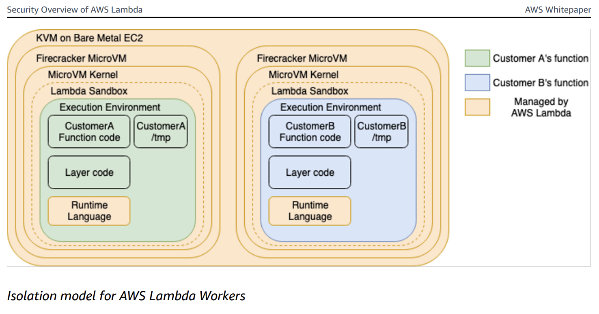
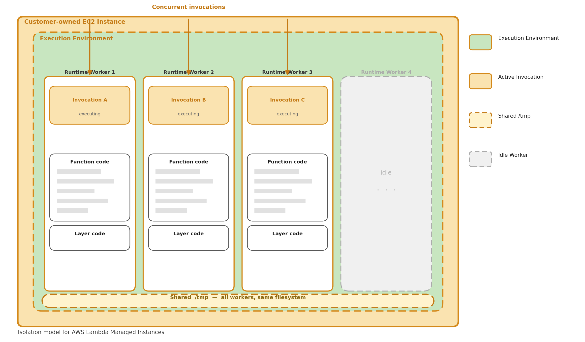

If you've been following this series, you know what AWS Lambda Managed Instances (LMI) are and what they cost. In [Part 1](/aws-lambda-managed-instances-part-1-overview) we covered the overview and in [Part 2](/aws-lambda-managed-instances-part-2-cost) we dug into the cost model. Now it's time to answer the question that actually matters for day-to-day development: **will my existing Lambda code work on LMI, and what will I need to change?**

The short answer is: maybe - _and possibly quite a bit_.

The execution model is fundamentally different from on-demand Lambda. Don't assume your code will behave the same way - some of these differences will silently corrupt your data, and others will just make your life harder. Read through all of them before migrating anything to production.

<!--truncate-->

<script async data-uid="2f82f140d9" src="https://curiousdev.kit.com/2f82f140d9/index.js"></script>

:::note
This post focuses on **Python** and **Node.js** runtimes. LMI also supports Java 21+ and .NET 8+, but the concurrency models for those runtimes are outside the scope of this post.
:::

## How Does AWS Lambda On-Demand Segregate Execution Environments?

If you're a seasoned Lambda developer, you may already know this. If not, don't worry - I'll provide just enough context so the rest of the post makes sense. This is pulled from the [Security Overview of AWS Lambda whitepaper](https://docs.aws.amazon.com/pdfs/whitepapers/latest/security-overview-aws-lambda/security-overview-aws-lambda.pdf).

On-demand Lambda creates its execution environments on a fleet of Amazon EC2 instances called **Lambda Workers**. Workers are bare metal Amazon EC2 AWS Nitro instances launched and managed by Lambda in a separate isolated AWS account not visible to customers. Workers have one or more hardware-virtualized Micro Virtual Machines (MVMs) created by Firecracker - an open-source Virtual Machine Monitor (VMM) that uses Linux's Kernel-based Virtual Machine (KVM).

As far as the Lambda function is concerned, it is the only thing running in its MVM. There is no sharing resources amongst multiple executions. **There is one execution per execution environment.**



## How Does AWS Lambda Managed Instances Segregate Execution Environments?

This is where things change.

In AWS LMI, **multiple** invocations run concurrently inside the same execution environment on EC2 instances. Rather than the strict one-invocation-per-MVM model of on-demand Lambda, LMI runs multiple runtime workers within the same execution environment - each worker handles an individual invocation simultaneously.



A few key behaviors fall out of this model:

**Continuous operation** Unlike on-demand Lambda, the execution environment stays continuously active. It doesn't freeze between invocations - it's always ready to pick up the next one.

**Parallel processing** Multiple invocations execute simultaneously, each handled by a separate runtime worker. The number of workers is configured when you set up the managed instance.

**Backpressure handling** If all runtime workers are busy, new invocation requests are rejected until a worker becomes available. This is a significant behavioral difference from on-demand - there's no fast scale-out to absorb a burst. Think minutes, not seconds.

**Independent timeouts.** The function timeout applies per-invocation. If one invocation times out, Lambda marks that invocation as failed but does *not* terminate the execution environment or interrupt other running invocations.

There are implications for each runtime, and they fall into two categories:

- 🔴 **Correctness issues** — these will silently break your function or corrupt data if you don't address them. (Considerations 1–4)
- 🟡 **Best practice issues** — these won't crash your function today, but will make debugging and operation significantly harder. (Considerations 5–7)

## 🔴 Consideration 1: Global Mutable State

In on-demand Lambda, you could safely mutate module-level variables during a request because only one invocation ran at a time. With LMI, multiple invocations share the same process or threads — mutating global state causes data leaks between requests.

**The takeaway:** Python gets a free pass here thanks to process isolation — global variables are safe between concurrent invocations. Node does not. Any module-level variable in Node that gets written during a request is a data leak waiting to happen. Scope everything to the handler.

### Python

Good news — Python uses separate processes per concurrent request, so global variables are isolated between invocations. However, if you use shared resources like files or external caches, the same principles apply.

<details>
<summary>Python sample</summary>

```python
# ✅ SAFE on Managed Instances — Python uses process-based isolation.
#    Each concurrent request gets its own process with its own memory space.
#    Global variables are NOT shared between concurrent invocations.

current_user = None

def handler(event, context):
    global current_user
    current_user = event["user_id"]
    result = process(current_user)
    # In Python on Managed Instances, this is safe because each
    # invocation runs in a separate process with its own copy of current_user.
    return {"user": current_user, "result": result}
```
</details>

### Node

Node uses worker threads with async concurrency — multiple invocations share the same global scope within a worker thread.

<details>
<summary>Node sample - broken ❌</summary>

```javascript
// ❌ BROKEN — global state is shared across concurrent async invocations
let currentUser = null;
let requestData = null;

export const handler = async (event, context) => {
  currentUser = event.userId;
  requestData = event.data;
  await processData(requestData);    // yields control to event loop
  // Another invocation may have overwritten currentUser by now
  return { user: currentUser };      // WRONG user!
};
```
</details>

<details>
<summary>Node sample - fixed ✅</summary>

```javascript
// ✅ FIXED — use local variables scoped to the handler invocation
export const handler = async (event, context) => {
  const currentUser = event.userId;  // local, not shared
  const requestData = event.data;
  await processData(requestData);
  return { user: currentUser };      // always correct
};
```
</details>

## 🔴 Consideration 2: Shared /tmp

In on-demand Lambda, `/tmp` was yours and yours alone per invocation. With LMI, all concurrent invocations within an execution environment share `/tmp`, regardless of runtime. This is the one gotcha that hits every language, including Python (despite its process isolation).

**The takeaway:** If you write to `/tmp`, always namespace the filename with
`context.aws_request_id` (or equivalent). Treat `/tmp` like a shared network drive, not a private scratch space — because on LMI, that's exactly what it is. Also clean up after yourself; with concurrent invocations all writing to the same volume, it's easier than ever to fill it up.

### Python

<details>
<summary>Python sample - broken ❌</summary>

```python
import json
import os

# ❌ BROKEN — concurrent invocations overwrite each other's file
def handler(event, context):
    data = transform(event["payload"])
    # Static filename - another execution might write to the same file.
    with open("/tmp/result.json", "w") as f:
        json.dump(data, f)
    # Another process may have overwritten /tmp/result.json
    # before you have a chance to read and return it.
    with open("/tmp/result.json", "r") as f:
        return json.load(f)  # could be another request's data!
```
</details>

<details>
<summary>Python sample - fixed ✅</summary>

```python
import json
import os

# ✅ FIXED — use request ID for unique file names
def handler(event, context):
    request_id = context.aws_request_id
    filepath = f"/tmp/result-{request_id}.json"
    data = transform(event["payload"])
    try:
        with open(filepath, "w") as f:
            json.dump(data, f)
        with open(filepath, "r") as f:
            return json.load(f)
    finally:
        # Best effort cleanup to avoid filling /tmp.
        os.remove(filepath)
```
</details>

### Node

<details>
<summary>Node sample - broken ❌</summary>

```javascript
import { writeFileSync, readFileSync } from "fs";

// ❌ BROKEN — same file path used by concurrent invocations
export const handler = async (event, context) => {
  // Static filename - another invocation might write to the same file.
  writeFileSync("/tmp/data.json", JSON.stringify(event.payload));
  // Another worker thread may overwrite the file here.
  const data = JSON.parse(readFileSync("/tmp/data.json", "utf8"));
  return data;  // could be another request's data!
};
```
</details>

<details>
<summary>Node sample - fixed ✅</summary>

```javascript
import { writeFileSync, readFileSync, unlinkSync } from "fs";

// ✅ FIXED — use request ID for unique file names
export const handler = async (event, context) => {
  const filepath = `/tmp/data-${context.awsRequestId}.json`;
  try {
    writeFileSync(filepath, JSON.stringify(event.payload));
    const data = JSON.parse(readFileSync(filepath, "utf8"));
    return data;
  } finally {
    try { unlinkSync(filepath); } catch {}
  }
};
```
</details>

## 🔴 Consideration 3: Database Connections

In on-demand Lambda, a single database connection per execution environment is fine — only one invocation used it at a time. With LMI, multiple concurrent invocations need their own connections, or they'll collide.

**The takeaway:** A single module-level connection was a common and acceptable Lambda pattern on-demand. On LMI it becomes a concurrency bug. Use connection pools sized appropriately for your worker count, and always return connections in a `finally` block. As a rule of thumb, your pool max should be at least equal to the number of configured runtime workers.

### Python

<details>
<summary>Python sample - broken ❌</summary>

```python
import psycopg2

# ❌ BROKEN — single connection shared across processes.
# Python processes are isolated in memory, but if you're using a module-level
# connection in a threaded context, or sharing via an external resource, this fails.
conn = psycopg2.connect(dsn)

def handler(event, context):
    cursor = conn.cursor()  # not safe if connection is shared
    cursor.execute("SELECT * FROM users WHERE id = %s", (event["user_id"],))
    return cursor.fetchone()
```
</details>

<details>
<summary>Python sample - fixed ✅</summary>

```python
from psycopg2 import pool

# ✅ FIXED — connection pool
# Each process gets its own pool instance due to Python's process-based isolation,
# but pooling is still best practice for connection reuse within a process.
connection_pool = pool.ThreadedConnectionPool(1, 10, dsn)

def handler(event, context):
    conn = connection_pool.getconn()
    try:
        cursor = conn.cursor()
        cursor.execute("SELECT * FROM users WHERE id = %s", (event["user_id"],))
        return cursor.fetchone()
    finally:
        connection_pool.putconn(conn)
```
</details>

### Node

<details>
<summary>Node sample - broken ❌</summary>

```javascript
import pg from "pg";

// ❌ BROKEN — single client shared across concurrent async invocations
const client = new pg.Client(connectionString);
await client.connect();

export const handler = async (event) => {
  // Concurrent queries on the same client cause unpredictable behavior
  const result = await client.query(
    "SELECT * FROM users WHERE id = $1",
    [event.userId]
  );
  return result.rows[0];
};
```
</details>

<details>
<summary>Node sample - fixed ✅</summary>

```javascript
import pg from "pg";

// ✅ FIXED — use a connection pool
const pool = new pg.Pool({ connectionString, max: 10 });

export const handler = async (event) => {
  const client = await pool.connect();
  try {
    const result = await client.query(
      "SELECT * FROM users WHERE id = $1",
      [event.userId]
    );
    return result.rows[0];
  } finally {
    client.release();
  }
};
```
</details>

## 🔴 Consideration 4: Backpressure and Event Source Configuration

On on-demand Lambda, if your function is overwhelmed with requests, Lambda scales out new execution environments to absorb the load. On LMI, that doesn't happen. When all runtime workers are busy, **new invocation requests are rejected** until a worker becomes available.

This has direct implications for how you configure event sources:

- **SQS triggers:** If invocations are being rejected, messages return to the queue and will be retried based on your visibility timeout. Size your worker count and visibility timeout together — if a message is retried while all workers are still busy, you're just pushing the problem forward. Consider a dead-letter queue to catch messages that can't get through after several attempts.

- **API Gateway / function URLs:** Rejected invocations surface as errors to the caller. Make sure your clients implement retry with backoff, and consider whether LMI is the right deployment model for latency-sensitive, bursty workloads.
- **EventBridge / async invocations:** Lambda will retry async invocations on failure, but rejections under backpressure count as failures. Review your retry policy and destination configuration.

**The takeaway:** LMI shifts the scaling responsibility from Lambda's infrastructure to your configuration. There's no automatic relief valve when traffic spikes — you need to engineer for it explicitly through worker count sizing, event source configuration, and retry/DLQ strategy.

## 🟡 Consideration 5: Logging

LMI functions use a structured JSON logging format that includes `requestId` in every log line. This is important — without it, interleaved log output from concurrent invocations is nearly impossible to untangle in CloudWatch.

[Powertools for AWS Lambda (Python)](https://docs.aws.amazon.com/powertools/python/latest/) and [Powertools for AWS Lambda (TypeScript)](https://docs.aws.amazon.com/powertools/typescript/latest/) both support LMI and make this straightforward. Capture Lambda context (including `function_request_id`) in [Python](https://docs.aws.amazon.com/powertools/python/latest/core/logger/#capturing-lambda-context-info)
and [Node](https://docs.aws.amazon.com/powertools/typescript/latest/features/logger/#capturing-lambda-context-info), and use thread-safe keys to enrich your logs in [Python](https://docs.aws.amazon.com/powertools/python/latest/core/logger/#working-with-thread-safe-keys)
and [Node](https://docs.aws.amazon.com/powertools/typescript/latest/features/logger/#appending-additional-keys).

**The takeaway:** Structured JSON logging with `requestId` is non-negotiable on LMI — without it, interleaved log lines from concurrent invocations are nearly impossible to untangle. Powertools handles this for you out of the box; use it.

### Python

<details>
<summary>Python sample - without Powertools ❌</summary>

```python
# ❌ WITHOUT Powertools — plain print statements have no request context.
#    Concurrent invocations produce interleaved output with no way to
#    correlate a log line to a specific request.

def handler(event, context):
    print(f"Processing event for user {event['user_id']}")
    result = process(event)
    print(f"Done processing")
    return result
```
</details>

<details>
<summary>Python sample - with Powertools ✅</summary>

```python
# ✅ WITH Powertools — structured JSON logs with requestId correlation.
#    Every log line includes function_request_id automatically once
#    you inject the Lambda context.

from aws_lambda_powertools import Logger

logger = Logger()

@logger.inject_lambda_context
def handler(event, context):
    logger.info("Processing event", user_id=event["user_id"])
    result = process(event)
    logger.info("Done processing")
    return result
```
</details>

### Node

<details>
<summary>Node sample - without Powertools ❌</summary>

```javascript
// ❌ WITHOUT Powertools — console.log has no request context.
//    Impossible to attribute log lines to specific invocations.

export const handler = async (event, context) => {
  console.log(`Processing event for user ${event.userId}`);
  const result = await process(event);
  console.log("Done processing");
  return result;
};
```
</details>

<details>
<summary>Node sample - with Powertools ✅</summary>

```javascript
// ✅ WITH Powertools — structured JSON logs with requestId correlation.

import { Logger } from "@aws-lambda-powertools/logger";

const logger = new Logger();

export const handler = async (event, context) => {
  logger.addContext(context);
  logger.info("Processing event", { userId: event.userId });
  const result = await process(event);
  logger.info("Done processing");
  return result;
};
```
</details>

## 🟡 Consideration 6: Thread-safe Collections

If you use shared collections — things like caches, counters, or registries — they need to be concurrency-safe.

**The takeaway:** Python's process isolation means in-memory caches and counters are safe, but they're also *local* — each worker process has its own copy, so there's no shared warm cache benefit across concurrent invocations. Node shares a global scope across async invocations, so any collection that gets written at runtime needs an explicit concurrency strategy.

### Python

Python process isolation means in-memory collections are safe by default. Each concurrent invocation gets its own process with its own copy. The drawback is that the cache is only available within that process — there is no cross-invocation cache benefit.

<details>
<summary>Python sample</summary>

```python
# ✅ SAFE on AWS LMI — each concurrent invocation gets its own process
#    with its own copy of the cache. No race conditions, but also no
#    sharing of cached values between concurrent invocations.
cache = {}

def handler(event, context):
    key = event["key"]
    if key not in cache:
        cache[key] = expensive_lookup(key)
    return cache[key]
```
</details>

### Node

<details>
<summary>Node sample - broken ❌</summary>

```javascript
// ❌ BROKEN — Map is shared across concurrent async invocations.
//    Race condition between has() check and set().
const cache = new Map();

export const handler = async (event, context) => {
  if (!cache.has(event.key)) {
    cache.set(event.key, await expensiveLookup(event.key));
    // Between the has() check and set(), another invocation may
    // have modified the cache.
  }
  return cache.get(event.key);
};
```
</details>

<details>
<summary>Node sample - fixed ✅</summary>

```javascript
// ✅ FIXED — deduplicate concurrent lookups for the same key using
//    a pending promises map to avoid redundant in-flight requests.
const cache = new Map();
const pending = new Map();

export const handler = async (event, context) => {
  const key = event.key;
  if (cache.has(key)) return cache.get(key);

  if (!pending.has(key)) {
    pending.set(key, expensiveLookup(key).then(val => {
      cache.set(key, val);
      pending.delete(key);
      return val;
    }));
  }
  return pending.get(key);
};
```
</details>

## 🟡 Consideration 7: Lambda Lifecycle

The lifecycle for LMI functions differs from on-demand in a few meaningful ways.

### Init Phase

On-demand Lambda init does three things: initialize extensions, bootstrap the runtime, and run your function's static initialization code. LMI does all of that too, but with one critical addition: **it spawns the configured number of runtime workers** before signaling readiness. The init phase isn't complete until at least one runtime worker has called `/runtime/invocation/next`.

This has a practical implication: LMI init can take significantly longer. On-demand init timeouts are tight; LMI initialization can take **up to 15 minutes**. The timeout is the greater of 130 seconds or your configured function timeout (up to 900 seconds). If you have cold start monitoring or alarms tuned for on-demand thresholds, revisit them.

### Invoke Phase

On-demand Lambda freezes the execution environment between invocations. LMI doesn't — the environment runs continuously, processing work as it arrives. The function timeout still applies, but on a per-invocation basis. One slow or timed-out invocation doesn't take down the environment.

### Error Handling

Error handling in LMI is notably different from on-demand:

- **Invocation timeouts** return a timeout error for that specific invocation but leave the execution environment running. Other concurrent invocations are unaffected.
- **Runtime worker crashes** are contained — the environment keeps processing with its remaining healthy workers.
- **Extension crashes** are fatal to the execution environment. If an extension crashes during initialization or operation, the entire environment is marked unhealthy and terminated. Lambda replaces it with a new one.
- **No reset/repair** On-demand Lambda attempts to reset and reinitialize an execution environment after certain errors. LMI does not — unhealthy containers are terminated and replaced outright.

**The takeaway** A single bad invocation won't kill the environment, but a crashed extension will — silently, taking any in-flight invocations with it. Make sure your extensions are production-hardened and that your observability captures environment-level termination events, not just individual invocation errors.

## Now What? A Migration Checklist

:::tip

**Worth asking before you start:**
Is LMI actually the right model for this function? LMI is a strong fit for high volume, steady, predictable workloads where you want consistent performance without cold start variance. It's a worse fit for bursty workloads that historically relied on Lambda's scale-out behavior to absorb spikes. If your function sees highly variable traffic, on-demand may still be the right answer.

:::

Before migrating any on-demand Lambda function to LMI, work through this checklist:

**Correctness — fix these before migrating:**
- [ ] No module-level mutable variables written during invocations (Node especially)
- [ ] All `/tmp` file paths namespaced with `context.aws_request_id`
- [ ] Database and external service clients use connection pools, not single connections
- [ ] Any shared in-memory collections are either read-only after init, or use an explicit concurrency guard (Node)

**Operations — configure these before going to production:**
- [ ] Powertools installed and configured with Lambda context injection
- [ ] SQS visibility timeouts and DLQ configured to account for backpressure-driven retries
- [ ] Async event source retry policies reviewed
- [ ] Cold start alarms updated to account for LMI's extended init timeout
- [ ] Extension dependencies reviewed for stability — an unstable extension takes down the whole environment

---

This wraps up the three-part series on AWS Lambda Managed Instances. If you missed the earlier posts, [Part 1](/aws-lambda-managed-instances-part-1-overview) covers what LMI is and when to use it, and [Part 2](/aws-lambda-managed-instances-part-2-cost) breaks down the cost model.

Stay curious! 🚀