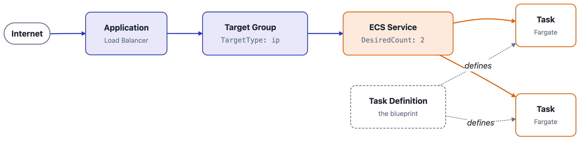

Two posts of theory. You've earned some YAML.

In [Part 1](https://blog.curiousdev.io/beyond-the-function-lambda-developer-discovers-ecs) we established that ECS is the orchestrator Lambda hid from you. In [Part 2](https://blog.curiousdev.io/one-ecs-three-engines) we picked an engine. Now we're going to stand up a real service — a container, behind a load balancer, running on Fargate, with logs you can actually read — and I'm going to explain every resource as we create it.

Fair warning: this is more moving parts than a Lambda function. That's not because ECS is bloated. It's because Lambda was quietly creating half of these parts for you. Now you get to see them.

<!-- truncate -->

<script async data-uid="2f82f140d9" src="https://curiousdev.kit.com/2f82f140d9/index.js"></script>

:::info

This is Part 3 of a series exploring Amazon ECS from a Lambda developer's point of view. [Part 1](https://blog.curiousdev.io/beyond-the-function-lambda-developer-discovers-ecs) covered the concepts, [Part 2](https://blog.curiousdev.io/one-ecs-three-engines) covered the three engines. This one lets you get your hands dirty.

:::

## What We're Building

One containerized web app, reachable from the internet, running as a managed ECS service that keeps itself alive.

Here's the shape of it:



Six things to create, in dependency order: a **registry** (somewhere the image lives), a **cluster** (the boundary), a **task definition** (the blueprint), an **ALB and target group** (how traffic finds you), an **IAM role or two** (permission to exist), and a **service** (the thing that keeps N tasks running).

I'm using CloudFormation but everything here maps cleanly to the console, the CDK, or Terraform if that's your world — the API underneath is the same, and I'll flag the naming differences where they bite.

You'll need a container image somewhere ECS can pull it. We'll create the ECR repository too — a service can't start without something to pull, so the registry is part of the job, not a prerequisite you're expected to already have.

:::tip

**Everything here is in [github.com/curiousdev-io/beyond-the-function](https://github.com/curiousdev-io/beyond-the-function/tree/main/deploy-ecs-fargate)** — `ecs-fargate.yaml`, a small Flask app with `/hello` and `/goodbye` routes to put behind the load balancer, and the deployment instructions. The registry template is one level up in `shared/`, because more than one example needs it.

The snippets below are trimmed to the parts worth explaining, and the repo has the same resources with the values pulled out into parameters. This post is about what each resource *means*; the repo is about getting it running.

:::

## Step 0: The Registry, In Its Own Stack

Before any of that, the image needs somewhere to live.

```yaml
AWSTemplateFormatVersion: "2010-09-09"

Resources:
  Repository:
    Type: AWS::ECR::Repository
    DeletionPolicy: Retain
    Properties:
      RepositoryName: curiousdev-demo
      ImageScanningConfiguration:
        ScanOnPush: true

Outputs:
  RepositoryUri:
    Value: !GetAtt Repository.RepositoryUri
    Export:
      Name: !Sub "${AWS::StackName}-RepositoryUri"
```

Seven lines of resource. The interesting decision isn't in the properties — it's that this is a **separate stack**.

Put the repository in the same template as the service and the first deploy fails, every time, in a way that looks like a bug and isn't: CloudFormation creates the repository, creates the service, the tasks try to pull an image from a repository nobody has pushed to yet, the circuit breaker trips, and the rollback deletes the empty repository you were about to push to. You can't break the cycle from inside one stack, because there's no point in a single `deploy` where you get to stop and run `docker push`.

The general shape is worth keeping: **CloudFormation is good at creating resources and bad at waiting for a human to do something in the middle.** When a deploy needs an artifact that doesn't exist yet, the artifact's stack goes first.

There's a second reason, and it outlasts the first. Registries have a longer lifecycle than the things they feed. You'll delete and recreate this service a dozen times while you're learning; your images shouldn't go with it. That's what `DeletionPolicy: Retain` is for.

So it's three steps, not one: registry stack, image push, service stack. The middle one is a human with a `docker build`, which is exactly the thing a single template can't express. The [repo](https://github.com/curiousdev-io/beyond-the-function/tree/main/deploy-ecs-fargate) wires those steps together so you don't have to remember the order.

One thing that push has to get right, because it shapes what we write next: build for the architecture the task definition asks for. We're going to request Graviton in Step 3, and an image built for x86 will start on Fargate and die instantly with `exec format error`.

The `Export` on that output is the other half of the design. It's how the service stack finds this repository later, without an account ID getting hardcoded anywhere — we'll pick it up in Step 3.

## Step 1: The Cluster (And the Capacity Provider I Promised)

The service lives in one template — `ecs-fargate.yaml` — and it starts with the handful of things I'm not going to build for you:

```yaml
AWSTemplateFormatVersion: "2010-09-09"
Description: A load-balanced ECS service on Fargate

Parameters:
  VpcId:
    Type: AWS::EC2::VPC::Id
  PublicSubnetIds:
    Type: List<AWS::EC2::Subnet::Id>
  PrivateSubnetIds:
    Type: List<AWS::EC2::Subnet::Id>
```

Now the easy resource. A cluster is a logical boundary — it doesn't provision anything by itself.

```yaml
Resources:
  Cluster:
    Type: AWS::ECS::Cluster
    Properties:
      ClusterName: curiousdev-demo
      ClusterSettings:
        - Name: containerInsights
          Value: enabled
      CapacityProviders:
        - FARGATE
        - FARGATE_SPOT
      DefaultCapacityProviderStrategy:
        - CapacityProvider: FARGATE
          Weight: 1
```

There's the capacity provider I kept teasing in Part 2. Three things worth noticing.

First, `FARGATE` and `FARGATE_SPOT` are **pre-existing** — every account has them, in every region Fargate supports. You don't create them, you just declare which ones this cluster is allowed to draw from. (EC2-backed and Managed Instances capacity providers are the ones you *do* create. Different story, later post.)

Second, that strategy list is the "rules for how ECS draws from the pool" I described last time, made concrete. Right now it's boring — one provider, all the weight. It gets interesting when you add a second provider and start splitting traffic between them.

Third, CloudFormation lets you attach capacity providers *inline* on the cluster, which is the shape most other tools don't have. There's also a standalone `AWS::ECS::ClusterCapacityProviderAssociations` resource for the same job — use it when the cluster is defined in a different stack from the thing that decides its capacity strategy. Don't use both against the same cluster; they'll fight, and the loser is whichever one updated last.

Turning on Container Insights costs a little money and buys you task-level CPU and memory metrics. Leave it on for now; we'll lean on it in Part 5.

## Step 2: Two IAM Roles, And Why There Are Two

This is the step that trips up more people than any other, so let's be precise.

ECS uses **two different roles**, and they answer two different questions:

- The **execution role** answers *"can the ECS agent set this task up?"* — pull the image from ECR, ship container logs to CloudWatch, resolve a secret into an environment variable. This is infrastructure permission, used *around* your container.
- The **task role** answers *"what can my application call?"* — read from S3, write to DynamoDB, publish to SNS. This is permission used *inside* your container, by your code.

If you've been mapping ECS onto Lambda concepts, resist the urge to match the names up — they lie. **Lambda's execution role is both of these merged into one.** It grants your code's AWS calls *and* the CloudWatch Logs permissions, in a single policy document. ECS draws a line through that role and splits it by *who's acting*: the agent working on your behalf around the container, versus your process running inside it. Logging lands on the execution role here because the `awslogs` driver runs at the agent level, outside your container — not because Lambda didn't need the permission.

Which means the trap is the vocabulary. Your Lambda "execution role" is ECS's **task role**. ECS's "execution role" is a different animal wearing a familiar name — and attaching your app's DynamoDB policy to it is a mistake that fails at runtime, not at deploy.

```yaml
  # Execution role — lets ECS pull images and ship logs
  ExecutionRole:
    Type: AWS::IAM::Role
    Properties:
      RoleName: curiousdev-demo-execution
      AssumeRolePolicyDocument:
        Version: "2012-10-17"
        Statement:
          - Effect: Allow
            Principal:
              Service: ecs-tasks.amazonaws.com
            Action: sts:AssumeRole
      ManagedPolicyArns:
        - arn:aws:iam::aws:policy/service-role/AmazonECSTaskExecutionRolePolicy

  # Task role — what YOUR code is allowed to do
  TaskRole:
    Type: AWS::IAM::Role
    Properties:
      RoleName: curiousdev-demo-task
      AssumeRolePolicyDocument:
        Version: "2012-10-17"
        Statement:
          - Effect: Allow
            Principal:
              Service: ecs-tasks.amazonaws.com
            Action: sts:AssumeRole
```

Both roles are assumed by the same principal — `ecs-tasks.amazonaws.com` — which is exactly why they're so easy to mix up. The trust policy doesn't distinguish them at all; only what you attach does. CloudFormation makes you repeat that trust document rather than share it (there's no equivalent of a policy-document data source), so if it starts multiplying, that's your signal to reach for a nested stack or a macro.

Note the task role starts with no policies attached. That's deliberate — attach exactly what your app needs, the same way you'd scope a Lambda role. Start empty, add on demand.

:::note

**Naming a role changes what the template is allowed to do.** Any template that creates IAM resources has to be acknowledged with the `CAPABILITY_IAM` capability — and the moment you set `RoleName`, that escalates to `CAPABILITY_NAMED_IAM`, because a predictable name is something an attacker could otherwise squat on. Whatever deploys the stack has to pass it, and if it doesn't, the failure lands before a single resource is created. Leave `RoleName` out and CloudFormation names the roles for you, at the cost of hunting for `curiousdev-demo-ExecutionRole-1A2B3C4D` in the console at 2am. I name them.

:::

So that's the theory. Here's how it actually bites you:

:::warning

**The error you're going to get:** `CannotPullContainerError`. Nine times out of ten it's the execution role missing ECR permissions, or a task in a private subnet with no route to ECR. It is almost never the image being broken. Check the role first, then the networking.

:::

## Step 3: The Task Definition

The blueprint. This is the closest thing ECS has to your Lambda function configuration.

```yaml
  LogGroup:
    Type: AWS::Logs::LogGroup
    Properties:
      LogGroupName: /ecs/curiousdev-demo
      RetentionInDays: 14

  TaskDefinition:
    Type: AWS::ECS::TaskDefinition
    Properties:
      Family: curiousdev-demo
      RequiresCompatibilities:
        - FARGATE
      NetworkMode: awsvpc
      Cpu: "256"
      Memory: "512"
      ExecutionRoleArn: !GetAtt ExecutionRole.Arn
      TaskRoleArn: !GetAtt TaskRole.Arn

      RuntimePlatform:
        OperatingSystemFamily: LINUX
        CpuArchitecture: ARM64 # Graviton — cheaper, and your image probably supports it

      ContainerDefinitions:
        - Name: app
          Image: !Sub
            - "${RepositoryUri}:latest"
            - RepositoryUri:
                Fn::ImportValue: curiousdev-demo-ecr-RepositoryUri
          Essential: true

          PortMappings:
            - ContainerPort: 8080
              Protocol: tcp

          LogConfiguration:
            LogDriver: awslogs
            Options:
              awslogs-group: !Ref LogGroup
              awslogs-region: !Ref AWS::Region
              awslogs-stream-prefix: app
```

A lot to unpack, so let's hit the parts that matter.

**`RequiresCompatibilities`** — there it is, the field from Part 2, in its CloudFormation spelling. Remember: this *declares what's allowed*, it doesn't decide where the task lands. The service does that.

**`NetworkMode: awsvpc`** — on Fargate this isn't a choice, it's the only option. Every task gets its own elastic network interface with its own private IP, like a tiny EC2 instance. This is why the service needs subnets and security groups later, and it's the single biggest mental shift coming from Lambda: **your task is a first-class citizen on your VPC now.**

**`Cpu` and `Memory` live at the task level, and they're strings.** Fargate requires both, and only certain combinations are valid — 256 CPU units pairs with 512/1024/2048 MB, and so on. The quotes aren't YAML pedantry, either: CloudFormation types both properties as `String`, so `Cpu: 256` hands it a number and it says no. Everyone spends one deploy cycle learning that. I know I did.

**`ContainerDefinitions` is real YAML here.** In most other tools this field is a JSON blob you encode by hand, which means typos surface at deploy time as an opaque API error. CloudFormation models it natively, so your editor can actually help you. The catch is capitalization: the container definition keys are `PascalCase` in CloudFormation (`ContainerPort`, `LogDriver`) but the `awslogs` *options* underneath are literal driver keys, so they stay lowercase and hyphenated. Copy `awslogs-stream-prefix` exactly.

**`RuntimePlatform` with `ARM64`** — this is the Graviton lever from Part 2, and on Fargate it's genuinely two lines. Cheaper per task, same code, assuming your image is multi-arch or built for ARM. If your image is x86-only, drop this block and it defaults to `X86_64`.

**The log group has to exist.** The `awslogs` driver won't create it for you by default, and a task that can't write logs fails to start. That's why the log group is a resource here, not an afterthought — and because the task definition references it with `!Ref`, CloudFormation works out the ordering for free.

**`Fn::ImportValue` reaches across stacks.** That's how the image URI arrives from the registry stack we deployed in Step 0, instead of an account ID getting hardcoded into a parameter file. The tradeoff is real, though: an export that another stack imports **cannot be changed or deleted** while that import exists. It's a one-way lock, and it's the usual reason a stack refuses to delete. Worth it for a stable identifier like a repository URI; not worth it for things you expect to churn.

**A word on `:latest`.** Push a new image to the same tag and nothing happens — CloudFormation diffs *templates*, the template didn't change, so there's no deployment. You either force one with `aws ecs update-service --force-new-deployment`, or you tag with the commit SHA and pass it as a parameter. The second one is the real answer, because it also gives you something to roll back *to*.

## Step 4: Load Balancer and Target Group

Lambda gave you an invocation endpoint for free. ECS makes you build the front door.

```yaml
  LoadBalancer:
    Type: AWS::ElasticLoadBalancingV2::LoadBalancer
    Properties:
      Name: curiousdev-demo-alb
      Type: application
      Subnets: !Ref PublicSubnetIds
      SecurityGroups:
        - !Ref AlbSecurityGroup

  TargetGroup:
    Type: AWS::ElasticLoadBalancingV2::TargetGroup
    Properties:
      Name: curiousdev-demo-tg
      Port: 8080
      Protocol: HTTP
      VpcId: !Ref VpcId
      TargetType: ip # ← not "instance"

      HealthCheckPath: /health
      HealthyThresholdCount: 2
      UnhealthyThresholdCount: 3
      HealthCheckTimeoutSeconds: 5
      HealthCheckIntervalSeconds: 30

  Listener:
    Type: AWS::ElasticLoadBalancingV2::Listener
    Properties:
      LoadBalancerArn: !Ref LoadBalancer
      Port: 80
      Protocol: HTTP
      DefaultActions:
        - Type: forward
          TargetGroupArn: !Ref TargetGroup
```

**`TargetType: ip` is the one to get right.** Because `awsvpc` gives every task its own ENI and IP, the load balancer targets *IPs*, not instances. The default is `instance`, which silently produces a target group that never registers anything. If your tasks are running and the ALB insists nothing is healthy, this is the first thing to check.

Health check settings are flat properties on the target group here rather than a nested block — `HealthCheckPath`, `HealthCheckIntervalSeconds`, and friends all sit at the top level. It reads a little shapeless, but it means you can grep the template for `HealthCheck` and find everything at once.

The health check path matters more than it looks. ECS will kill and replace tasks that fail it, so if `/health` doesn't exist in your app yet, either add it or point the check at something that returns a 200. Otherwise you get a beautiful infinite loop of tasks starting, failing, and being replaced — and the ECS console will happily do that all day without telling you why.

## Step 5: Security Groups (The Part Lambda Never Made You Think About)

Two groups, one rule between them.

```yaml
  AlbSecurityGroup:
    Type: AWS::EC2::SecurityGroup
    Properties:
      GroupDescription: Public ingress to the load balancer
      VpcId: !Ref VpcId
      SecurityGroupIngress:
        - IpProtocol: tcp
          FromPort: 80
          ToPort: 80
          CidrIp: 0.0.0.0/0

  TaskSecurityGroup:
    Type: AWS::EC2::SecurityGroup
    Properties:
      GroupDescription: Tasks — reachable only from the ALB
      VpcId: !Ref VpcId
      SecurityGroupIngress:
        - IpProtocol: tcp
          FromPort: 8080
          ToPort: 8080
          SourceSecurityGroupId: !Ref AlbSecurityGroup # only the ALB, nothing else
```

The task security group only accepts traffic from the ALB's security group — `SourceSecurityGroupId`, not a CIDR block. That's the pattern worth internalizing: your tasks aren't reachable from the internet at all, only through the load balancer.

Two CloudFormation specifics in that snippet.

**`GroupDescription` is required.** Not optional, not defaulted — leave it out and the template fails validation before a single resource is created. Every other tool invents one for you.

**There's no egress block, and that's intentional.** When you omit `SecurityGroupEgress`, CloudFormation leaves EC2's default allow-all-outbound rule in place. This is the *opposite* of how Terraform behaves, where declaring a security group with no egress removes that default and quietly strands your tasks. If you're arriving from an HCL codebase, this is the one to unlearn: here, silence means open.

Egress stays open because the task needs to pull its image from ECR and ship logs to CloudWatch. If you're locking things down properly you'd add explicit `SecurityGroupEgress` rules and VPC endpoints, but let's get it running first.

## Step 6: The Service

Everything so far has been setup. This is the resource that actually makes containers exist.

```yaml
  Service:
    Type: AWS::ECS::Service
    DependsOn: Listener
    Properties:
      ServiceName: curiousdev-demo
      Cluster: !Ref Cluster
      TaskDefinition: !Ref TaskDefinition
      DesiredCount: 2

      CapacityProviderStrategy:
        - CapacityProvider: FARGATE
          Weight: 1

      NetworkConfiguration:
        AwsvpcConfiguration:
          Subnets: !Ref PrivateSubnetIds
          SecurityGroups:
            - !Ref TaskSecurityGroup
          AssignPublicIp: DISABLED

      LoadBalancers:
        - TargetGroupArn: !Ref TargetGroup
          ContainerName: app
          ContainerPort: 8080

      DeploymentConfiguration:
        DeploymentCircuitBreaker:
          Enable: true
          Rollback: true

      HealthCheckGracePeriodSeconds: 60
      EnableExecuteCommand: true
```

This is where Part 1's vocabulary becomes real. `DesiredCount: 2` is you naming the number. The service's entire job is to make reality match that number — if a task dies, it starts another one, no pager required.

:::warning

**The gotcha that'll cost you twenty minutes:** you cannot set `LaunchType` and `CapacityProviderStrategy` on the same service. It's one or the other. Half the ECS tutorials on the internet still use `LaunchType: FARGATE`, so if you copy-paste from an older guide into this template, the stack will fail — and because it fails during `CREATE_IN_PROGRESS` rather than at validation, you'll watch it roll back the whole thing to find out. Delete the `LaunchType` line; keep the strategy.

:::

A few of the other properties are worth knowing rather than just copying:

**`DeploymentCircuitBreaker`** — note it's nested inside `DeploymentConfiguration`, not a top-level property. If a deployment can't stabilize, ECS gives up and rolls back to the previous task definition automatically. Turn this on everywhere. It's the difference between a bad deploy being a non-event and a bad deploy being your evening. It also composes nicely with CloudFormation's own rollback: ECS reverts the tasks, then the stack reverts the resources.

**`HealthCheckGracePeriodSeconds`** — how long the ALB waits before health checks count against a new task. If your app takes 45 seconds to warm up and this is unset, the ALB will start killing healthy-but-slow tasks in a loop. Set it a bit above your real startup time. Set it generously in CloudFormation especially: the stack sits in `CREATE_IN_PROGRESS` until the service stabilizes, so a flapping health check turns into a very long, very quiet wait.

**`EnableExecuteCommand`** — turns on ECS Exec, which is how you get a shell inside a running task. Non-negotiable for debugging, and on Fargate it's the *only* way in since there's no host to SSH to.

**`AssignPublicIp: DISABLED`** — a string, not a boolean. `false` will be rejected. It's `ENABLED` or `DISABLED`, and this is one of several places where the ECS API's own vocabulary shows through CloudFormation unfiltered.

**`DependsOn: Listener`** — the service can't register targets until the listener exists, and nothing in the service's properties references the listener, so CloudFormation has no way to infer the ordering. Without this you get an intermittent failure that passes on a retry and fails again on a fresh account. Declare it explicitly.

## Watch It Come Alive

Once both stacks are up — registry first, with an image pushed into it, then the service — you have a running ECS service. Here's how you confirm it, and these are the three commands worth memorizing:

```bash
# Is it running?
aws ecs describe-services \
  --cluster curiousdev-demo \
  --services curiousdev-demo \
  --query 'services[0].{desired:desiredCount,running:runningCount,status:status}'

# What is it saying?
aws logs tail /ecs/curiousdev-demo --follow

# Get me inside it
aws ecs execute-command \
  --cluster curiousdev-demo \
  --task <task-id> \
  --container app \
  --interactive \
  --command "/bin/sh"
```

That last one is worth sitting with for a second. You just opened an interactive shell inside a running container, on infrastructure you don't own, with no SSH key and no bastion host. For anyone who spent years unable to poke at a running Lambda, it's a small revelation.

Then hit the ALB's DNS name. The demo app in the repo answers on two routes, both taking an optional `name`:

```bash
curl "http://$ALB_DNS/hello?name=Brian"
# {"message":"Hello, Brian!","route":"hello"}

curl "http://$ALB_DNS/goodbye"
# {"message":"Goodbye, World!","route":"goodbye"}
```

That's your app, on your VPC, behind your load balancer.

## When It Doesn't Work

It won't, the first time. Here's the triage order that solves most of it:

| Symptom | Look here first |
|---|---|
| Task stuck in `PENDING`, then stops | Execution role permissions, or no route to ECR from a private subnet |
| Tasks running, ALB says unhealthy | `TargetType: ip`, or the health check path 404s |
| Tasks start and die in a loop | Health check grace period too short, or the app is crashing — check the logs |
| `CannotPullContainerError` | Execution role, image tag, or ECR networking |
| `exec format error` | Image built for the wrong CPU architecture |
| Stack fails creating the service | `LaunchType` and `CapacityProviderStrategy` both set |
| Stack fails before creating anything | Missing `CAPABILITY_NAMED_IAM`, or `Cpu`/`Memory` written as numbers |
| Stack hangs in `CREATE_IN_PROGRESS` for 20+ minutes | The service never stabilized — tasks are failing health checks |

Two habits do most of the work here.

The first is **reading the `stoppedReason` on a stopped task.** ECS tells you exactly why it killed something, and it's the first place to look rather than the last.

```bash
aws ecs describe-tasks \
  --cluster curiousdev-demo \
  --tasks <task-id> \
  --query 'tasks[0].stoppedReason'
```

The second is CloudFormation-specific: **read stack events oldest-first, and trust the first failure.** A failed stack prints a wall of `CREATE_FAILED` and `ROLLBACK_IN_PROGRESS` lines, and almost all of them are consequences. The real cause is the earliest one.

```bash
aws cloudformation describe-stack-events \
  --stack-name curiousdev-demo \
  --query 'reverse(StackEvents[?ResourceStatus==`CREATE_FAILED`].[LogicalResourceId,ResourceStatusReason])' \
  --output text
```

One more thing that catches people coming from other tools: a stack stuck in `ROLLBACK_COMPLETE` cannot be updated. There's no re-running the deploy to fix it — delete the stack and deploy again. Annoying the first time, expected forever after.

And if you'd rather start from something that already works and break it on purpose, the templates and the demo app are in [github.com/curiousdev-io/beyond-the-function](https://github.com/curiousdev-io/beyond-the-function/tree/main/deploy-ecs-fargate).

## The Real Win

Count what we built: a registry, a cluster, two IAM roles, a task definition, a log group, a load balancer, a target group, a listener, two security groups, and a service. For one container.

That is genuinely more than `serverless deploy`. But look at what each piece is actually doing — Lambda was creating every single one of these for you, invisibly, with defaults you never got to see. The load balancer was the invocation endpoint. The security group was AWS's opinion about your network. The execution role was the control plane's private business.

None of this is new complexity. **It's the same complexity, made visible.** And now every one of those defaults is a decision you're allowed to make differently: put the tasks on a private subnet, lock ingress to a single security group, run on Graviton by changing one line, roll back automatically when a deploy goes sideways.

You met ECS by accident in Part 1, picked an engine in Part 2, and now you've built the thing. Every switch Lambda hid is a line in a file you own.

Next up: **the operational reality — the networking and scaling Lambda hid from you**, and why `awsvpc` changes how you think about everything downstream.

Stay curious! 🚀
